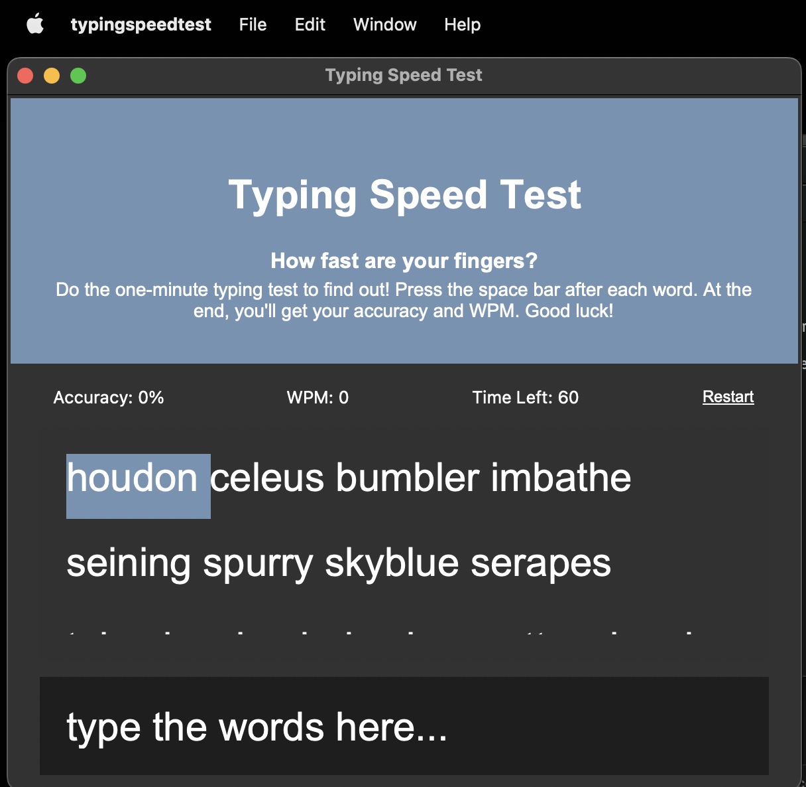
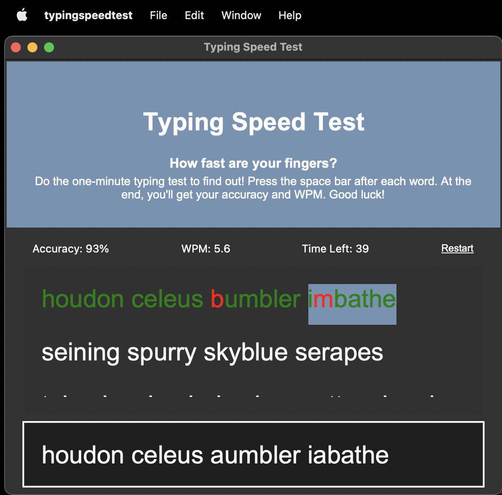
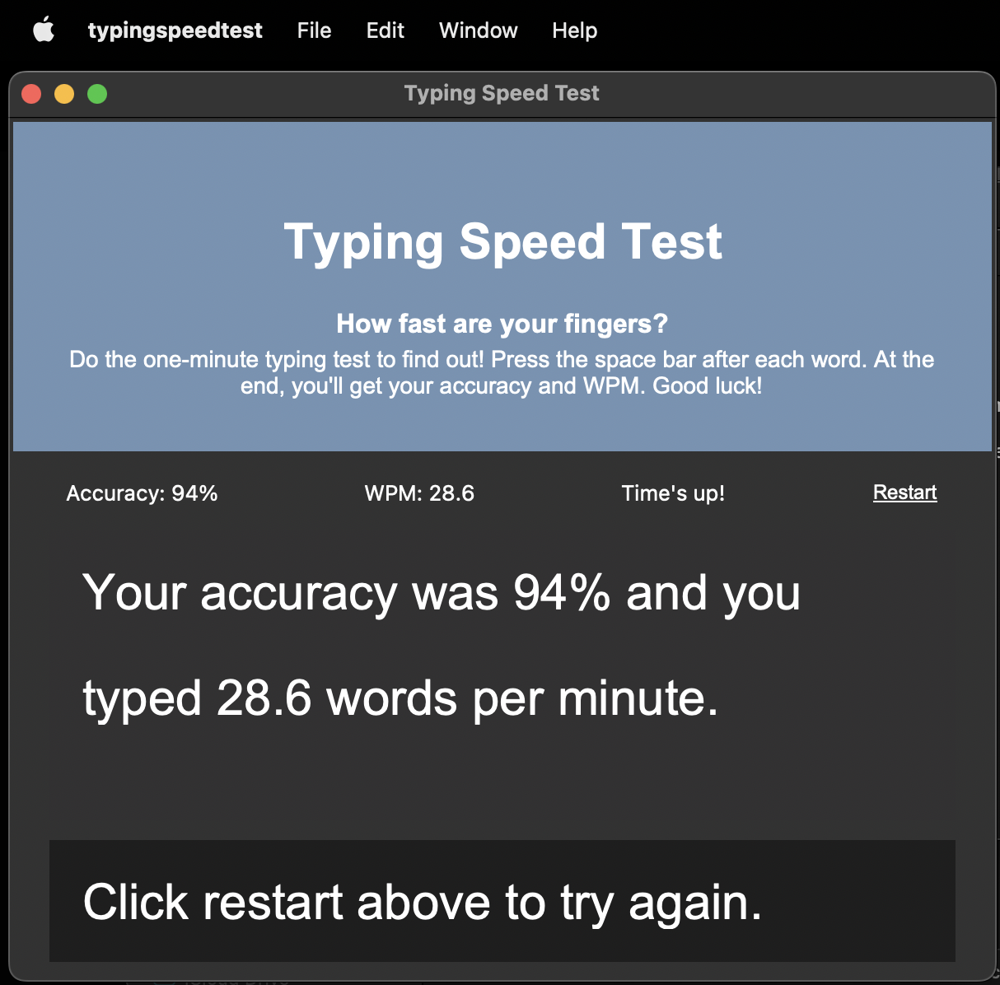

# 100 Days of Code: The Complete Python Pro Bootcamp for 2023 - Day 86 - Typing Seed Test
 - Entertainment web app solution

This is a solution my to the [Typing Seed Test](https://www.udemy.com/course/100-days-of-code/).

## Table of contents

- [Overview](#overview)
  - [The challenge](#the-challenge)
  - [Screenshot](#screenshot)
  - [Links](#links)
- [My process](#my-process)
  - [Built with](#built-with)
  - [What I learned](#what-i-learned)
  - [Continued development](#continued-development)
  - [Useful resources](#useful-resources)
- [Author](#author)
- [Acknowledgments](#acknowledgments)

## Overview

### The challenge

Using Tkinter and what I have learned about building GUI applications with Python, I built a desktop app that assesses your typing speed. Using the Wordnik API I provide the user some sample text and detect how many words they can type per minute and how accurate they are.

I used this site as a blueprint: [blueprint](https://typing-speed-test.aoeu.eu/)

### Screenshot

#### Home

#### Search

#### Movie Mobile

### Built with

- python3
- Tkinter
- Wordnik API

### What I learned

This project took me much longer than the alloted 90 minutes to complete, but I wanted a finished product that could be used, and I think I accomplished that. This project shows my progression as a developer. Given a fairly new language, Python, use a library that I have barely used, Tkinter, to create this project. Previously, during class assignments, I would have sat shell shocked as I fumbled about trying to solve the problem. But through experience I was able to take this project in stride and learn/re-learn the library, and implement the logic. It was a worthwhile project for me.

## Author

- Website - [my site](https://rugh.us)
- Frontend Mentor - [@roodhouse](https://www.frontendmentor.io/profile/roodhouse)
- LinkedIn - [John Rugh](https://www.linkedin.com/in/john-m-rugh/)
